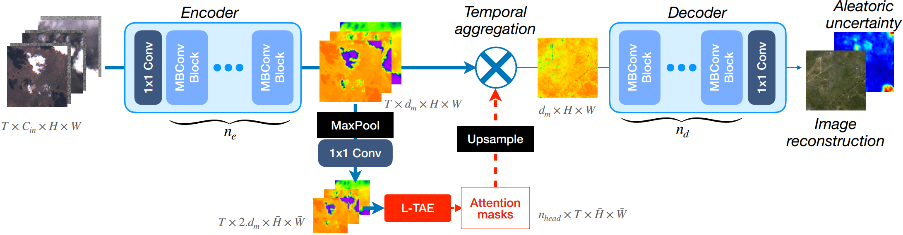

# UnCRtainTS: Uncertainty Quantification for Cloud Removal in Optical Satellite Time Series


>
> _This is the official repository for UnCRtainTS, a network for multi-temporal cloud removal in satellite data combining a novel attention-based architecture, and a formulation for multivariate uncertainty prediction. These two components combined set a new state-of-the-art performance in terms of image reconstruction on two public cloud removal datasets. Additionally, we show how the well-calibrated predicted uncertainties enable a precise control of the reconstruction quality._
----
This repository contains code accompanying the paper
> P. Ebel, V. Garnot, M. Schmitt, J. Wegner and X. X. Zhu. UnCRtainTS: Uncertainty Quantification for Cloud Removal in Optical Satellite Time Series. Proceedings of the IEEE Conference on Computer Vision and Pattern Recognition Workshops, 2023.

For additional information:

* The publication is available in the [CVPRW Proceedings](https://openaccess.thecvf.com/content/CVPR2023W/EarthVision/papers/Ebel_UnCRtainTS_Uncertainty_Quantification_for_Cloud_Removal_in_Optical_Satellite_Time_CVPRW_2023_paper.pdf). 
* The SEN12MS-CR-TS data set is accessible at the MediaTUM page [here](https://mediatum.ub.tum.de/1639953) (train split) and [here](https://mediatum.ub.tum.de/1659251) (test split).
* You can find additional information on this and related projects on the associated [project page](https://patricktum.github.io/cloud_removal/).
* For any further questions, please reach out to me here or via the credentials on my [website](https://pwjebel.com).
---

## Installation
### Dataset

You can easily download the multi-temporal SEN12MS-CR-TS (and, optionally, the mono-temporal SEN12MS-CR) dataset via the shell script in [`./util/dl_data.sh`](https://github.com/PatrickTUM/UnCRtainTS/blob/main/util/dl_data.sh). Alternatively, you may download the SEN12MS-CR-TS data set (or parts of it) via the MediaTUM website [here](https://mediatum.ub.tum.de/1639953) (train split) and [here](https://mediatum.ub.tum.de/1659251), with further instructions provided in the dataset's own [dedicated repository](https://github.com/PatrickTUM/SEN12MS-CR-TS#dataset).

### Code
Clone this repository via `git clone https://github.com/PatrickTUM/UnCRtainTS.git`.

and set up the Python environment via 

```bash
conda env create --file environment.yaml
conda activate uncrtaints
```

Alternatively, you may install all that's needed via 
```bash
pip install -r requirements.txt
```
or by building a Docker image of `Dockerfile` and deploying a container.

The code is written in Python 3 and uses PyTorch $\geq$ 2.0. It is strongly recommended to run the code with CUDA and GPU support. The code has been developed and deployed in Ubuntu 20 LTS and should be able to run in any comparable OS.

---

## Usage
### Dataset 
If you already have your own model in place or wish to build one on the SEN12MS-CR-TS data loader for training and testing, the data loader can be used as a stand-alone script as demonstrated in `./standalone_dataloader.py`. This only requires the files `./data/dataLoader.py` (the actual data loader) and `./util/detect_cloudshadow.py` (if this type of cloud detector is chosen).

For using the dataset as a stand-alone with your own model, loading multi-temporal multi-modal data from SEN12MS-CR-TS is as simple as

``` python
import torch
from data.dataLoader import SEN12MSCRTS
dir_SEN12MSCRTS = '/path/to/your/SEN12MSCRTS'
sen12mscrts     = SEN12MSCRTS(dir_SEN12MSCRTS, split='all', region='all', n_input_samples=3)
dataloader      = torch.utils.data.DataLoader(sen12mscrts)

for pdx, samples in enumerate(dataloader): print(samples['input'].keys())
```

and, likewise, if you wish to (pre-)train on the mono-temporal multi-modal SEN12MS-CR dataset:
 
``` python
import torch
from data.dataLoader import SEN12MSCR
dir_SEN12MSCR   = '/path/to/your/SEN12MSCR'
sen12mscr       = SEN12MSCR(dir_SEN12MSCR, split='all', region='all')
dataloader      = torch.utils.data.DataLoader(sen12mscr)

for pdx, samples in enumerate(dataloader): print(samples['input'].keys())
```

Note that computing cloud masks on the fly, depending on the choice of cloud detection, may slow down data loading. For greater efficiency, files of pre-computed cloud coverage statistics can be 
downloaded [here](https://syncandshare.lrz.de/getlink/fiHhwCqr7ch3X39XoGYaUGM8/splits) or pre-computed via `./util/pre_compute_data_samples.py`, and then loaded with the `--precomputed /path/to/files/` flag.

### Basic Commands
You can train a new model via
```bash
cd ./UnCRtainTS/model
python train_reconstruct.py --experiment_name my_first_experiment --root1 path/to/SEN12MSCRtrain --root2 path/to/SEN12MSCRtest --root3 path/to/SEN12MSCR --model uncrtaints --input_t 3 --region all --epochs 20 --lr 0.001 --batch_size 4 --gamma 1.0 --scale_by 10.0 --trained_checkp "" --loss MGNLL --covmode diag --var_nonLinearity softplus --display_step 10 --use_sar --block_type mbconv --n_head 16 --device cuda --res_dir ./results --rdm_seed 1
```
and you can test a (pre-)trained model via
```bash
python test_reconstruct.py --experiment_name my_first_experiment -root1 path/to/SEN12MSCRtrain --root2 path/to/SEN12MSCRtest --root3 path/to/SEN12MSCR --input_t 3 --region all --export_every 1 --res_dir ./inference --weight_folder ./results
```

For a list and description of all flags, please see the parser file `./model/parse_args.py`. To perform inference with pre-trained models, [here](https://syncandshare.lrz.de/getlink/fiBCH9ycWVBNsJxK23nZhg/checkpoints)'s where you can find the checkpoints. Every checkpoint is accompanied by a json file, documenting the flags set during training and expected to reproduce the model's behavior at test time. If pointing towards the exported configurations upon call, the correct settings get loaded automatically in the test script. Finally, following the exporting of model predictions via `test_reconstruct.py`, multiple models' outputs can be ensembled via `ensemble_reconstruct.py`, to obtain estimates of epistemic uncertainty.

---


## References

If you use this code, our models or data set for your research, please cite [this](https://arxiv.org/pdf/2304.05464.pdf) publication:
```bibtex
@inproceedings{UnCRtainTS,
        title = {{UnCRtainTS: Uncertainty Quantification for Cloud Removal in Optical Satellite Time Series}},
        author = {Ebel, Patrick and Garnot, Vivien Sainte Fare and Schmitt, Michael and Wegner, Jan and Zhu, Xiao Xiang},
        booktitle = {Proceedings of the IEEE Conference on Computer Vision and Pattern Recognition Workshops},
        year = {2023},
        organization = {IEEE},
        url = {"https://openaccess.thecvf.com/content/CVPR2023W/EarthVision/papers/Ebel_UnCRtainTS_Uncertainty_Quantification_for_Cloud_Removal_in_Optical_Satellite_Time_CVPRW_2023_paper.pdf"}
} 
```
You may also be interested in our related works, which you can discover on the accompanying [website](https://patricktum.github.io/cloud_removal/).


## Credits

This code was originally based on the [UTAE](https://github.com/VSainteuf/utae-paps) and the [SEN12MS-CR-TS](https://github.com/PatrickTUM/SEN12MS-CR-TS) repositories. Thanks for making your code publicly available! We hope this repository will equally contribute to the development of future exciting work.
